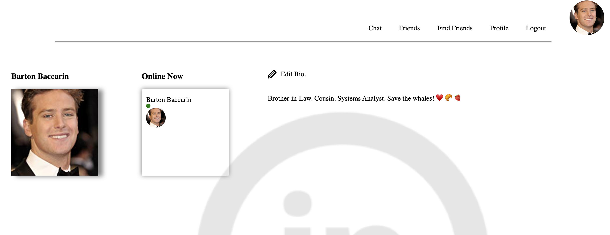
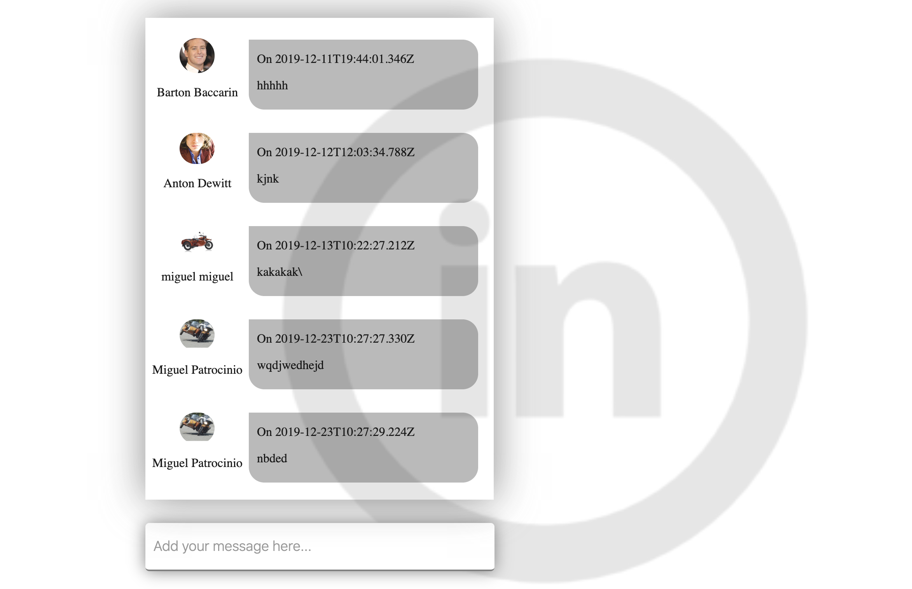

# Overview 

React-based authenticated social network with chat functionality.
Features include a personal profile, image upload, list of online friends, sending, receiving, and accepting friend requests. 

# Tech

AWS S3, Node, PostgreSQL, Socket.IO, React & Redux

# Images

